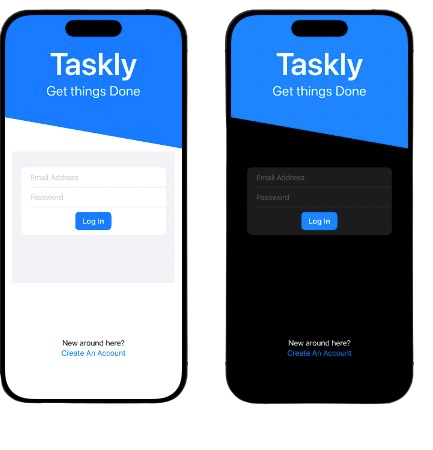
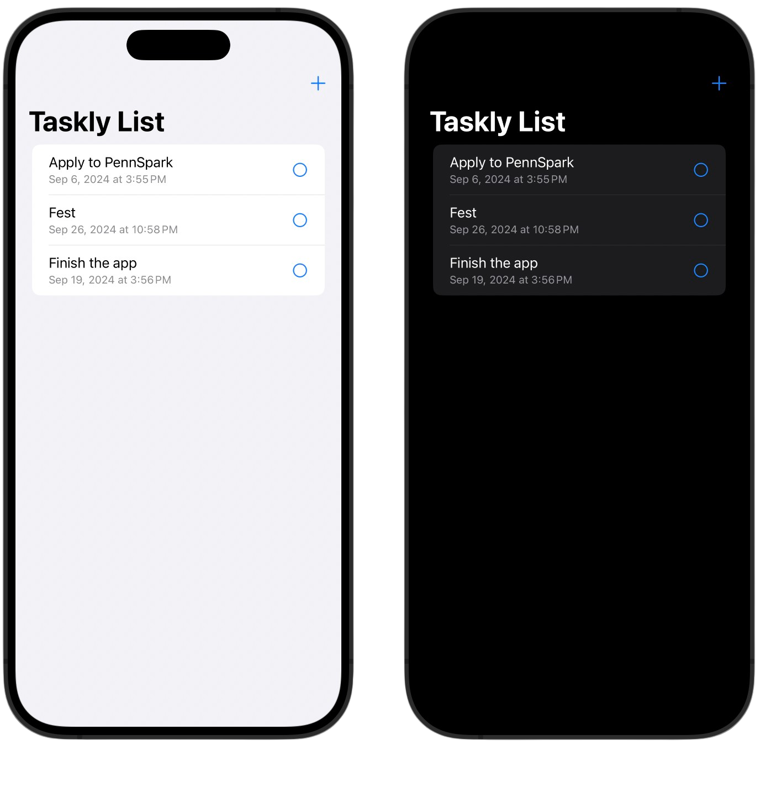

# Taskly - To-Do List App

Welcome to Taskly, a simple and intuitive to-do list app built with Swift to help you stay organized and productive. With Taskly, you can easily manage tasks, set priorities, and track your progress—all in one place!

## Features
- **Add Tasks**: Quickly add tasks with a simple tap.
- **Edit Tasks**: Need to make changes? You can easily edit task details at any time.
- **Task Prioritization**: Assign priority levels to your tasks, so you always know what’s most important.
- **Mark as Complete**: Check off tasks when they're done and watch your progress grow.
- **Customizable UI**: Clean, user-friendly design with customizable themes to suit your style.
- **Due Date Reminders**: Set due dates to make sure nothing slips through the cracks.

## How to Use
1. **Add a New Task**: Tap the “+” button to create a new task. Enter the task name, set a priority, and (optionally) a due date.
2. **Edit or Delete a Task**: Tap on any task to edit its details or delete it.
3. **Mark as Complete**: Once you complete a task, simply check it off to move it to your completed tasks list.
4. **View Task List**: The main screen shows your to-do list with tasks organized by priority and due date, making it easy to see what’s next.

## Why Taskly?
Taskly is designed to make task management easy and stress-free. Whether you're managing daily errands, work projects, or long-term goals, Taskly keeps everything organized in one place—so you can focus on getting things done.

## Tech Stack
- **Language**: Swift
- **Platform**: iOS
- **Frameworks**: SwiftUI
- **Database**: Firebase

## Feedback and Support
If you encounter any bugs or have suggestions for improvement, feel free to reach out! Let’s make Taskly even better together.
